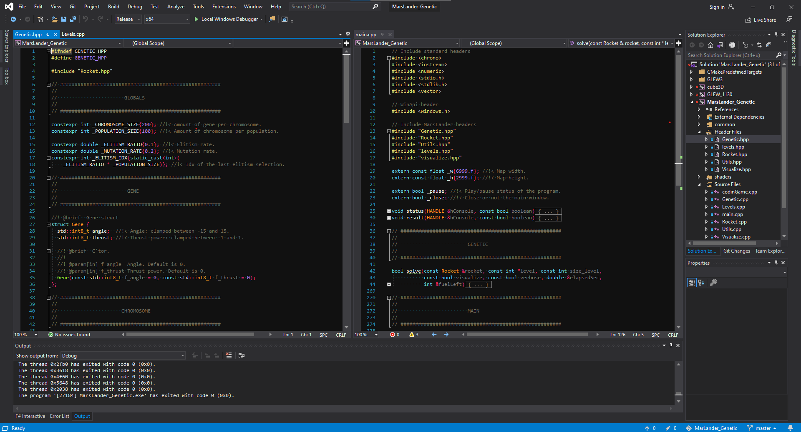
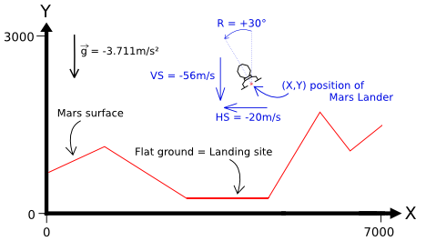

# MarLander - Genetic Algorithm

Resolve the series of CodinGame's problem called Mars Lander using a Genetic Algorithm.


Links of the problems:
 - [Mars Lander - Episode 1](https://www.codingame.com/ide/puzzle/mars-lander-episode-1)
 - [Mars Lander - Episode 2](https://www.codingame.com/ide/puzzle/mars-lander-episode-2)
 - [Mars Lander - Episode 3](https://www.codingame.com/ide/puzzle/mars-lander-episode-3)
 - [Mars Lander - Optimization](https://www.codingame.com/ide/puzzle/mars-lander)

Solution developed in ***C++*** and using ***modern OpenGL*** for the visualization part.

## How-to compile and use

This project uses CMake and this how-to shows how-to use it with Visual Studio.

1) Launch your CMake-gui application
2) *"Where is the source code:"* is the current repo
3) *"Where to build the binaries:"* is usually a build folder in the current repo
4) Press *"Configure"* and then *"Generate"*
5) Close your CMake-gui application and launch the *"MarsLander_Genetic.sln"* in the build folder

Then, under Visual Studio:

1) Build -> Build Solution (once done you can play around with OpenGL with the project cube3D, my *Hello World* to check that everything is fine)
2) On the *"Solution Explorer"* tab, right click on the *"MarsLander_Genetic"* project then *"Set as Startup Project"*
3) Line 60 to 62, you can modify the initialization of the variables *"size_level"*, *"level"* and *"population"* to play around with different levels, available in *"levels.hpp"*

CMake-gui | Visual Studio
:---: | :---:
 | 

## Statements of the problem

On a *limited zone* of Mars, there is ***a unique*** area of flat ground on the surface.

***Every second***, depending on the current flight parameters (location, speed, fuel ...), the program must provide the new desired tilt angle and thrust power of the ship.



The game simulates a free fall without atmosphere. Gravity on Mars is 3.711 m/s².
For a thrust power of X, a push force equivalent to X m/s² is generated and X liters of fuel are consumed. As such, a thrust power of 4 in an almost vertical position is needed to compensate for the gravity on Mars.


For a landing to be successful, the ship must:
 - land on flat ground
 - land in a vertical position (tilt angle = 0°)
 - vertical speed must be limited ( ≤ 40m/s in absolute value)
 - horizontal speed must be limited ( ≤ 20m/s in absolute value)

## Environment of Simulation

Using modern OpenGL for the visualization, the first step was to simulate the Mars environment and the evolution of the ship's position, velocity and acceleration.

By just letting the ship falling with and without initial horizontal velocity and comparing with CodinGame, it ensures proper application of basic physics:

Without initial horizontal velocity | With initial horizontal velocity
:---: | :---:
 | 

Then manually adding rotation and thrust power requests, and comparing with CodinGame, it ensures proper application of the overall problem's physics:

With rotation and thrust power requests |
:---: |
 |

We are now ready to go with the Genetic Algorithm!

## Genetic Algorithm

#### Architecture

The architecture is as follow:

```cpp
struct Gene {
    std::int8_t angle;
    std::int8_t power;
};

struct Chromosome {
    Gene chromosome[_CHROMOSOME_SIZE];
    double fitness;
};

/* Population class:
*
* Contains two arrays of population to optimize the run-time performances.
* The two pointers 'population' and 'new_population' will alternatively point to 'populationA' and 'populationB'.
* In that way, we reduce the amount of memory allocation/de-allocation and just stick with memory access.
*/
class Population {
public:
	GeneticPopulation();

	// Fill the next population by performing elitism, selection, crossover and mutation.
	void mutate();

private:
    Chromosome populationA[_POPULATION_SIZE];	//!< One population of chromosomes
    Chromosome populationB[_POPULATION_SIZE];	//!< Another one

    Chromosome* population; 	//!< Ptr to the current population
    Chromosome* new_population;	//!< Ptr to the next population
}
```

#### Fitness

TODO

#### Selection

The selection is done using ***Fitness proportionate selection*** (also known as *roulette wheel*):


#### Crossover

The crossover is a weighted average sum.

Given two parents $P_1= [Gp^1_1, Gp^1_2, ..., Gp^1_n]$ and $P_2= [Gp^2_1, Gp^2_2, ..., Gp^2_n]$, the creation of two children $C_1=[Gc^1_1, Gc^1_2, ..., Gc^1_n]$ and $C_2=[Gc^2_1, Gc^2_2, ..., Gc^2_n]$ is done as follow:

For every pair of genes $(Gp^1_i, Gp^2_i)$, take a random number $r \in [0, 1]$ and then:
 - $Gc^1_i = r * Gp^1_i + (1-r) * Gp^2_i$
 - $Gc^2_i = (1 - r) * Gp^1_i + r * Gp^2_i$

#### Mutation and Elitism

For every children, each gene has 1% chance of mutating.

The top 10% of the parents is automatically copied, as it, in the next generation.