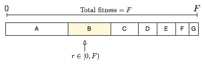

# MarLander - Genetic Algorithm

Resolve the series of CodinGame's problem called Mars Lander using a Genetic Algorithm.

Incremental research | Solution found
:---: | :---:
 | [gif7_2](data/gif/level7_2.gif)

Links of the problems:
 - [Mars Lander - Episode 1](https://www.codingame.com/ide/puzzle/mars-lander-episode-1) - Easy
 - [Mars Lander - Episode 2](https://www.codingame.com/ide/puzzle/mars-lander-episode-2) - Medium
 - [Mars Lander - Episode 3](https://www.codingame.com/ide/puzzle/mars-lander-episode-3) - Very hard
 - [Mars Lander - Optimization](https://www.codingame.com/ide/puzzle/mars-lander)

Solution developed in ***C++*** and using ***modern OpenGL*** for the visualization.

Level1 | Level2 | Level3
:---: | :---: | :---:
 |  | 

## How-to compile and use

This project uses CMake and this how-to shows how-to use it with Visual Studio.

1) Launch your CMake-gui application
2) *"Where is the source code:"* is the current repo
3) *"Where to build the binaries:"* is usually a build folder in the current repo
4) Press *"Configure"* and then *"Generate"*
5) Close your CMake-gui application and launch the *"MarsLander_Genetic.sln"* in the build folder

Then, under Visual Studio:

1) Build -> Build Solution (once done you can play around with OpenGL with the project cube3D, my *Hello World* to check that everything is fine)
2) On the *"Solution Explorer"* tab, right click on the *"MarsLander_Genetic"* project then *"Set as Startup Project"*
3) In the file `levels.hpp`, you can modify the name of the macro `LEVEL7` (line 9) to whatever level you want (from 1 to 7 included).

CMake-gui | Visual Studio
:---: | :---:
 | 

## Statements of the problem

On a *limited zone* of Mars, there is ***a unique*** area of flat ground on the surface.

***Every second***, depending on the current flight parameters (location, speed, fuel ...), the program must provide the new desired tilt angle and thrust power of the ship.


The game simulates a free fall without atmosphere. Gravity on Mars is 3.711 m/s².
For a thrust power of X, a push force equivalent to X m/s² is generated and X liters of fuel are consumed. As such, a thrust power of 4 in an almost vertical position is needed to compensate for the gravity on Mars.


For a landing to be successful, the ship must:
 - land on flat ground
 - land in a vertical position (tilt angle = 0°)
 - vertical speed must be limited ( ≤ 40m/s in absolute value)
 - horizontal speed must be limited ( ≤ 20m/s in absolute value)

## Environment of Simulation

Using modern OpenGL for the visualization, the first step was to simulate the Mars environment and the evolution of the ship's position, velocity and acceleration.

By just letting the ship falling with and without initial horizontal velocity and comparing with CodinGame, it ensures proper application of basic physics:

Without initial horizontal velocity | With initial horizontal velocity
:---: | :---:
 | 

Then manually adding rotation and thrust power requests, and comparing with CodinGame, it ensures proper application of the overall problem's physics:

With rotation and thrust power requests |
:---: |
 |

We are now ready to go with the Genetic Algorithm!

## Genetic Algorithm

### Architecture

The architecture is as follow:

```cpp
/* Rocket class
*
* A rocket object used to simulate the movements in the atmosphere of Mars.
*/
class Rocket {
public:
    // Rocket c'tr
    Rocket(const double f_x, const double f_y, const double f_vx, const double f_vy, const std::int8_t f_angle, const std::int8_t f_power, const int f_fuel);
    
    // Simulate the move of the rocket for 1sec with the given command
    void updateRocket(const std::int8_t f_angle, const std::int8_t f_thrust);

private:
    double pX;           //!< x-coordinate of the rocket 1sec ago
    double pY;           //!< y-coordinate of the rocket 1sec ago
    double x;            //!< current x-coordinate of the rocket
    double y;            //!< current y-coordinate of the rocket
    double vx;           //!< current horizontal velocity of the rocket
    double vy;           //!< current vertical velocity of the rocket
    double ax;           //!< current horizontal acceleration of the rocket
    double ay;           //!< current vertical acceleration of the rocket
    std::int8_t angle;   //!< current angle of the rocket
    std::int8_t thrust;  //!< current thrust of the rocket
    int fuel;            //!< amount of fuel (in L) still available of the rocket  
};

/* Gene struct
*
* Contains an angle/thrust request.
*/
struct Gene {
    std::int8_t angle;
    std::int8_t thrust;
};

/* Chromosome struct
*
* Contains a set of angle/thrust requests and the fitness score obtained by following them.
*/
struct Chromosome {
    Gene chromosome[_CHROMOSOME_SIZE];
    double fitness;
};

/* Population class
*
* Contains two arrays of population to optimize the run-time performances.
* The two pointers 'population' and 'new_population' will alternatively point to 'populationA' and 'populationB'.
* In that way, we reduce the amount of memory allocation/de-allocation and just stick with memory access.
*/
class Population {
public:
    GeneticPopulation();

    // Fill the next population by computing the fitness and performing elitism, selection, crossover and mutation.
    void mutate();

private:
    Chromosome populationA[_POPULATION_SIZE];	//!< One population of chromosomes
    Chromosome populationB[_POPULATION_SIZE];	//!< Another one

    Chromosome* population; 	   //!< Ptr to the current population
    Chromosome* new_population;	//!< Ptr to the next population
    
    Rocket rockets_gen[_POPULATION_SIZE]; //!< The simulated rockets
}
```

### Fitness

#### Step 1: The closer from the landing zone, the better!

A good metric to have a higher score when you are closer is the inverse of the distance: `f(x) = 1 / x`.

However, accordingly to your use cases distribution, it might work or not. Let's then generalize it a bit try to find the best score function with our data:

 - The score will be something like `f(x) = a / (b + c * x)`,
 - Let's find `a`, `b` and `c`.
 
By running a good number of random parameters on all the cases and measuring the distance between the crash zones and the landing zones, we can see that the distances vary from `0 meter` to almost `100 000 meters`. Watching at the diversity, let's define `n points` with the score that *would represent how good they are*. Thanks to those `n points`, one can easily compute the `a`, `b` and `c` that fits them the best.

In my case, I found that `f(x) = 1000 / (1 + 0.009999 * x)` works well, with its scores in the range `]0, 1000]`.

#### Step 2: Once on the landing zone, penalize fast landers!

Here, we can take into account the speed of the landers within the score calculus in two cases:

 1. Always.
 2. Only for the landers which crashed into the landing zone.

And to take into account the speed, two strategies are possible:

 1. The lower the speed is, the more we increase the score.
 2. The higher the speed is, the more we penalize the score.

I decided to **penalized the fast landers which crashed into the landing zone**. In that way, landers who crashed close to the landing zone could still have a good chance of being selected as parents.

Here, I thought about using two quadratics function (one for the vertical speed and one the horizontal speed): we are looking for `fx(vx) = ax * vx^2 + bx * vx + cx` and `fy(vy) = ay * vy^2 + by * vy + cy`.

As before, by watching at the data on random examples, by selecting a few points and by computing the best parameters:

 - Horizontal speed penality: `fx(vx) = 0.00036057692307692 * vx^2 + 0.069711538461538 * vx - 3.3653846153846`
 - Vertical speed penality: `fy(vy) = 0.0003968253968254 * vy^2 + 0.051587301587302 * vy - 1.1904761904762`

### Selection

The selection is done using ***Fitness proportionate selection*** (also known as *roulette wheel*):



### Crossover

The crossover is a weighted average sum:


<!-- Given two parents $P_1=[Gp^1_1, Gp^1_2, ..., Gp^1_n]$ and $P_2=[Gp^2_1, Gp^2_2, ..., Gp^2_n]$, the creation of two children $C_1$ and $C_2$  is done as follow:

For every pair of genes $(Gp^1_i, Gp^2_i)$, take a random number $r \in [0, 1]$ and then:
 - $Gc^1_i = r * Gp^1_i + (1-r) * Gp^2_i$
 - $Gc^2_i = (1 - r) * Gp^1_i + r * Gp^2_i$

At the end, you obtain $C_1=[Gc^1_1, Gc^1_2, ..., Gc^1_n]$ and $C_2=[Gc^2_1, Gc^2_2, ..., Gc^2_n]$. -->

### Mutation and Elitism

For every children, each gene has 1% chance of mutating.

The top 10% of the parents is automatically copied, as it, in the next generation.
